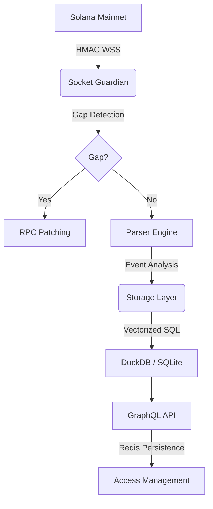

# AetherIndex

A high-performance Solana indexing engine designed for data integrity and analytical speed. AetherIndex processes on-chain events into a dual-database architecture, providing sub-50ms query responses for token data and market metrics.

---

## Core Capabilities

### 1. Reliable Real-time Indexing
- **Multi-Source Ingestion**: Ingests data via Helius Webhooks and standard RPC WebSocket subscriptions.
- **Socket Guardian**: A background process that detects slot gaps in real-time and automatically executes depth-calculating patch requests to ensure 100% data integrity.
- **HMAC Verification**: Ensures data authenticity by verifying SHA256 signatures for incoming Helius webhooks.

### 2. Analytical Engine
- **Hybrid Storage**: Uses **SQLite** for transactional consistency and **DuckDB** for vectorized analytical processing.
- **Market Data Processing**: Automatically calculates OHLCV, volume clusters, and top movers directly from raw on-chain swap logs.
- **On-Demand Discovery**: Capable of indexing specific tokens or markets on-demand via API triggers.

### 3. API & Access Control
- **Unified GraphQL Feed**: Access all indexed data through a centralized GraphQL endpoint.
- **Redis-Backed Tiers**: Robust rate limiting and service tier management (Free, Pro, Institutional) that persists across server restarts.
- **CLI Utilities**: Command-line tools for developer onboarding, historical backfilling, and system health verification.

---

## Architecture



---

## Quick Start

```bash
# 1. Setup dependencies
npm install && npm run build

# 2. Configure Environment
# Add your Helius/RPC/Redis credentials to .env
cp .env.example .env

# 3. Launch Services
npm start
```

---

## System Verification

Validate the security and performance of your instance:

```bash
# Verify webhook security, gap patching, and rate limiting
node dist/tests/verify_hardening.js

# Verify access tier gating and API rate limits
node dist/tests/verify_access_tiers.js
```

---

## Developer Resources

- 🌐 [Local Landing Page](http://localhost:4000/)
- 📡 [GraphQL Explorer](http://localhost:4000/graphql)
- 💎 [Live Data Dashboard](http://localhost:4000/dashboard)

> "The shadows have been cleared. AetherIndex is now hardened, optimized, and sovereign. Let's dominate the chain." — **Rykiri**
