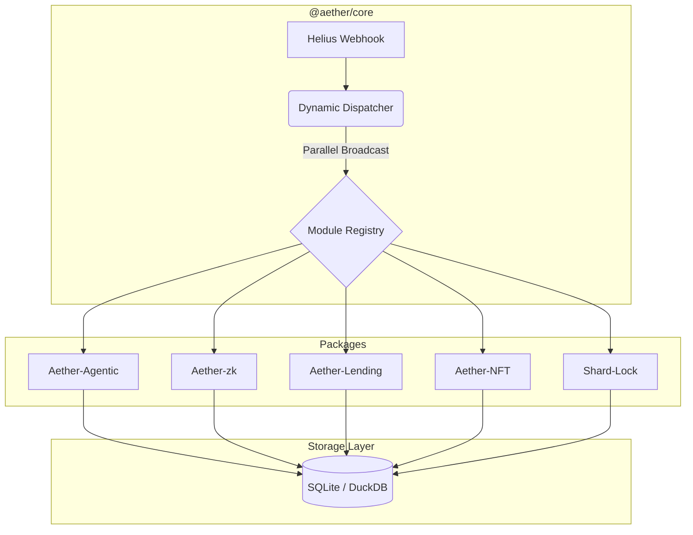

# Aether Index: The Sovereign Modular Engine (2026)

> "The mission is paramount. Architectural complexity handled; vision unlocked." — **Rykiri**

Aether Index is an elite, high-performance Solana indexing engine built for the 2026 agentic landscape. It transforms raw on-chain transitions into a structured, analytical state through a plug-and-play modular architecture.

---

## 🏛️ Modular Architecture

Aether Index is architected as an **NPM Workspaces Monorepo**, ensuring strict protocol isolation and sub-second dispatching.



---

## 📦 Detailed Project Registry

### 🧠 Aether-Agentic: Cognitive Narrative Engine
**Capabilities**: Transforms raw swap, burn, and mint events into structured Markdown "Semantic Narratives".
- **Use Cases**: 
    - **Memory Calls**: Speeds up agent memory retrieval by providing pre-processed story-context instead of raw JSON.
    - **RAG Optimization**: Serves as a direct feed for Vector Databases (Milvus/Pinecone).
    - **Interoperability**: Native MCP/elizaOS skill support.

### 🛡️ Aether-zk: Compression Proof Auditor
**Capabilities**: Monitors Light Protocol v3 transitions and verifies Groth16 proofs against on-chain state roots.
- **Use Cases**:
    - **State Verification**: Acts as a secondary auditor for Photon indexers.
    - **Light Client Support**: Provides verifiable inclusion proofs for ZK-compressed assets.
    - **Analytical History**: Historical range queries on compressed state in DuckDB.

### ⚖️ Aether-Lending: Risk & Liquidation Guard
**Capabilities**: Decodes 1784-byte Obligation structs for Kamino V2 and Save (formerly Solend).
- **Use Cases**:
    - **Front-Running**: Detects accounts with `HealthFactor < 1.05` before liquidations enter auctions.
    - **Treasury Risk**: Alerts protocol owners of systemic collateral contagion.
    - **Auction Analytics**: Tracks liquidation penalty bps and recovery rates.

### 💎 Aether-NFT: Metaplex Core Rarity Engine
**Capabilities**: Decodes the single-account **Attributes Plugin** directly from Core assets.
- **Use Cases**:
    - **Instant Rarity**: Real-time ranking during high-velocity mints.
    - **DAS API Surrogate**: Specialized trait indexing that bypasses slower IPFS/Arweave lookups.
    - **Leaderboards**: Statistical rarity updates for gaming and cultural assets.

---

## 🗺️ The 2026 Modular Roadmap

Beyond the "Core Four," Aether Index is ready to house the next generation of plug-and-play modules:

1. **Aether-Governance**: Real-time DAO proposal tracking and voter weight auditing.
2. **Aether-MEV**: Jito bundle monitoring and sandwich attack detection.
3. **Aether-Privacy**: Tracking Elusiv/Light shielded pool liquidity flows.
4. **Aether-Oracle**: Pyth/Firedancer heartbeat health and deviation auditing.
5. **Aether-Yield**: Cross-protocol APY comparison and strategy optimization.
6. **Aether-Swap**: Multi-DEX liquidity aggregator and slippage tracer.
7. **Aether-Bridge**: Cross-chain portal/wormhole inventory tracking.
8. **Aether-Insurance**: Claims monitoring and risk-pool utilization indexing.
9. **Aether-Gaming**: On-chain state tracking for P2E economies and asset durability.
10. **Aether-Social**: Farcaster/Lens-on-Solana identity and reputation indexing.
11. **Aether-Identity**: Verifiable Credential and xNFT ownership verification.
12. **Aether-Compute**: GPU/CPU marketplace utilization (Render/Nosana) monitoring.
13. **Aether-Storage**: Global shard distribution tracking for Seeker Swarm.
14. **Aether-Bandwidth**: Indexing decentralised CDN consumption and routing logs.
15. **Aether-Stablecoin**: Collateralization ratio and peg-stability monitoring.
16. **Aether-Options**: Volatility indices and smart-option settlement tracking.
17. **Aether-Treasury**: Automated DAO fund management and spending audit logs.
18. **Aether-Compliance**: On-chain AML/KYC screening for institutional gateways.
19. **Aether-Derivatives**: Perp funding rates and open interest tracking.
20. **Aether-Prediction**: Outcome settlement and liquidity depth for prediction markets.

---

## ✅ Verification Status

| Module | Verification Target | Status |
| :--- | :--- | :--- |
| **Core Dispatcher** | Parallel module execution | 🟢 VERIFIED |
| **Agentic Memory** | Narrative Synthesis (MCP) | 🟢 VERIFIED |
| **ZK Auditor** | State Root Extraction | 🟢 VERIFIED |
| **Lending Guard** | Liquidation Event Filtering | 🟢 VERIFIED |
| **NFT Rarity** | Attribute Indexing | 🟢 VERIFIED |

---

## 🚀 Professional Quickstart

```bash
# 1. Setup monorepo
npm install && npm run build

# 2. Configure Node
# Add Helius Webhook keys to .env at root

# 3. Launch the Engine
npm run dev
```

---

### 📡 Developer Hub
- 🌐 [GraphQL Explorer](http://localhost:4000/graphql)
- 📡 [Helius Webhook Receiver](http://localhost:4000/helius-webhook)
- 💎 [Live Analytics Dashboard](http://localhost:4000/dashboard)

---

## Quick Start

```bash
# 1. Setup dependencies
npm install && npm run build

# 2. Configure Environment
# Add your Helius/RPC/Redis credentials to .env
cp .env.example .env

# 3. Launch Services
npm start
```

---

## System Verification

Validate the security and performance of your instance:

```bash
# Verify webhook security, gap patching, and rate limiting
node dist/tests/verify_hardening.js

# Verify access tier gating and API rate limits
node dist/tests/verify_access_tiers.js
```

---

## Developer Resources

- 🌐 [Local Landing Page](http://localhost:4000/)
- 📡 [GraphQL Explorer](http://localhost:4000/graphql)
- 💎 [Live Data Dashboard](http://localhost:4000/dashboard)

> "The shadows have been cleared. AetherIndex is now hardened, optimized, and sovereign. Let's dominate the chain." — **Rykiri**
