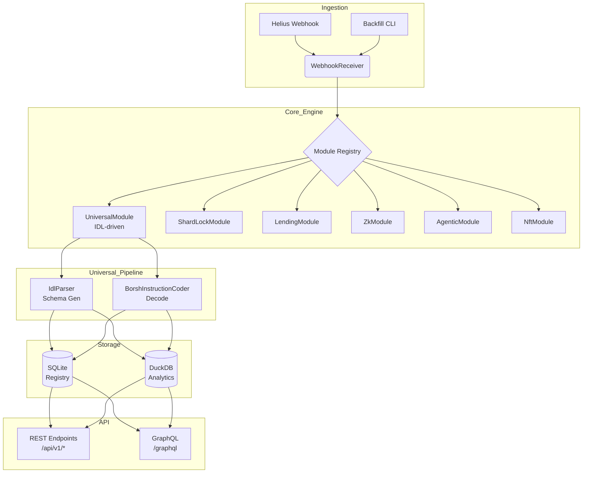

# Aether Index: Universal Solana Indexer

> **Dynamic Schema • Automatic Decoding • Real-time + Batch**

Aether Index is a production-ready **Universal Solana Indexer** that automatically adapts to any Anchor program. Drop an IDL into `data/idls/` and Aether will generate the database schema, decode transactions in real-time, and expose a fully-featured REST API — zero manual configuration required.

---

## 🏆 Core Technical Highlights

Aether is architected to be robust, secure, and fully dynamic. Here is how the core capabilities are implemented under the hood:

- **Dynamic Anchor IDL parsing:** Built in \`packages/aether-core/src/worker/idl_parser.ts\`. The \`IdlParser.generateSchema()\` method reads any JSON IDL and builds dynamic column arrays.
- **Universal Indexing (Real-time & Batch):**
  - **Real-time:** \`UniversalModule\` (\`packages/aether-core/src/modules/universal.ts\`) auto-registers IDLs, creates dynamic SQLite/DuckDB tables, and ingests webhook data on the fly using \`BorshInstructionCoder\`.
  - **Batch/Backfill:** \`packages/aether-core/src/bin/backfill.ts\` processes historical slot ranges or signatures via CLI.
- **Exponential Backoff:** Implemented in \`backfill.ts\` via the \`withRetry()\` function which uses \`BASE_DELAY_MS * Math.pow(2, attempt) + jitter\` for RPC resilience.
- **API SQL Injection Hardening:** Secured in \`UniversalModule\` (\`universal.ts\`). We generate an **IDL-derived Column Whitelist** at startup. The REST API validates all \`req.query\` filters against this \`Set\`—if a parameter isn't in the Anchor schema, it is completely ignored, neutralizing SQL injection vectors without ORM overhead.

---

## ✨ Key Features

| Requirement | Implementation |
| :--- | :--- |
| **Dynamic Schema** | `IdlParser` reads any Anchor IDL and generates SQLite + DuckDB tables at startup |
| **Instruction Decoding** | `BorshInstructionCoder` from `@coral-xyz/anchor` decodes instruction data automatically |
| **Account State Indexing** | Account schemas are parsed from IDL and stored with pubkey as primary key |
| **Real-time Mode** | Helius Enhanced Webhooks push transactions to the engine in real-time |
| **Cold Start / Backfill** | `backfill` CLI tool replays historical transactions with exponential backoff |
| **Batch Mode** | Process any slot range or signature list via CLI |
| **Exponential Backoff** | All RPC calls use configurable retry with jitter (`2^attempt * 500ms`) |
| **Graceful Shutdown** | SIGINT/SIGTERM handlers ensure no partial writes |
| **Multi-param Filtering** | `GET /api/v1/indexed/:program/:instruction?key=value&key2=value2` |
| **Aggregation / Stats** | `GET /api/v1/stats/:program/summary?since=2026-03-01` |
| **Program Discovery** | `GET /api/v1/programs/:name` returns indexed instructions and tables |
| **Structured Logging** | Console-based structured logs with module prefixes |
| **Docker Compose** | Single `docker-compose up` for full stack |

---

## 🏗️ Architecture



---

## 🚀 Quick Start

### Prerequisites
- Node.js 18+
- npm

### 1. Clone & Install

```bash
git clone https://github.com/RYthaGOD/Aether-Index.git
cd Aether-Index
npm install && npm run build
```

### 2. Configure Environment

```bash
cp .env.example .env
# Edit .env with your Helius API key and RPC URL
```

### 3. Add an IDL (Universal Indexer)

Drop any Anchor IDL into the `data/idls/` directory. The filename must be the program's public key:

```
data/idls/
  └── GtmN6x2aPYq6LkbJTj1qxm5Jn6zGQNWsgG9NFnx1QaEu.json
```

### 4. Launch

```bash
# Development
npm run dev

# Production (Docker)
docker-compose up -d
```

On startup, you'll see:
```
🚀 AETHER LIBRARIAN ONLINE
[Librarian] Auto-Registering Universal Module: seeker_sentinel (GtmN6x2a...)
[Universal] 2 dynamic tables registered.
```

---

## 📡 API Reference

### Query Indexed Data

```bash
# Get all 'submitHeartbeat' instructions
curl http://localhost:4000/api/v1/indexed/seeker_sentinel/submitHeartbeat

# Filter by signer
curl "http://localhost:4000/api/v1/indexed/seeker_sentinel/submitHeartbeat?signer=ABC...&limit=50"

# Paginate results
curl "http://localhost:4000/api/v1/indexed/seeker_sentinel/submitHeartbeat?limit=20&offset=40"
```

### Aggregation & Stats

```bash
# Total instruction counts
curl http://localhost:4000/api/v1/stats/seeker_sentinel/summary

# Counts since a specific date
curl "http://localhost:4000/api/v1/stats/seeker_sentinel/summary?since=2026-03-01T00:00:00Z"
```

**Response:**
```json
{
  "programId": "GtmN6x2aPYq6LkbJTj1qxm5Jn6zGQNWsgG9NFnx1QaEu",
  "program": "seeker_sentinel",
  "instructions": {
    "submitheartbeat": 1542
  },
  "totalInstructions": 1542
}
```

### Program Discovery

```bash
curl http://localhost:4000/api/v1/programs/seeker_sentinel
```

### GraphQL

```bash
curl http://localhost:4000/graphql \
  -H 'Content-Type: application/json' \
  -d '{"query":"{ getShardLocations(merkleRoot: \"abc\") { node_pubkey status } }"}'
```

---

## 🔄 Batch Mode (Backfill)

Replay historical transactions for any program:

```bash
npx ts-node packages/aether-core/src/bin/backfill.ts \
  -p GtmN6x2aPYq6LkbJTj1qxm5Jn6zGQNWsgG9NFnx1QaEu \
  -i data/idls/GtmN6x2aPYq6LkbJTj1qxm5Jn6zGQNWsgG9NFnx1QaEu.json \
  -s 280000000 -e latest
```

Features:
- **Exponential backoff** with jitter on all RPC calls
- **Progress logging** every 50 transactions
- **Failure tolerance** — logs permanently failed txs but continues processing

---

## 🛡️ Reliability & Error Handling

| Feature | Details |
| :--- | :--- |
| **Exponential Backoff** | `withRetry()` in backfill uses `500ms * 2^attempt + jitter`, 5 max retries |
| **Graceful Shutdown** | SIGINT/SIGTERM handlers flush pending DuckDB writes before exit |
| **Socket Guardian** | Background worker detects slot gaps and logs audit warnings |
| **HWM Tracking** | `system_metadata` table stores last processed slot for cold-start recovery |
| **SQL Injection Prevention** | API query filter keys are validated against IDL-derived column whitelist |
| **DuckDB Write Queue** | Non-blocking background queue prevents analytics writes from blocking ingestion |

---

## 🧩 Modular Design

Beyond the Universal Indexer, Aether ships with specialized modules:

| Module | Purpose |
| :--- | :--- |
| **Aether-Agentic** | Transforms swap/mint events into semantic AI narratives for RAG pipelines |
| **Aether-ZK** | Indexes Light Protocol v3 compressed state and Groth16 proof logs |
| **Aether-Lending** | Monitors Kamino V2 and Save (Solend) liquidation events |
| **Aether-NFT** | Decodes Metaplex Core asset attributes for real-time rarity ranking |
| **Shard-Lock** | Tracks decentralized storage node heartbeats for Seeker Swarm |

Each module implements the `AetherModule` interface and self-registers its own API routes via `extendServer()`.

---

## 📁 Project Structure

```
Aether-Index/
├── data/idls/              # Drop Anchor IDL JSONs here (auto-discovered)
├── packages/
│   ├── aether-core/        # Engine: webhook receiver, DB client, backfill CLI
│   │   ├── src/
│   │   │   ├── api/        # Express server + GraphQL
│   │   │   ├── bin/        # CLI tools (backfill)
│   │   │   ├── db/         # SQLite + DuckDB client, schemas
│   │   │   ├── modules/    # Universal indexer + Shard-Lock module
│   │   │   └── worker/     # IdlParser, Guardian, WebhookManager
│   │   └── tests/
│   ├── aether-agentic/     # AI narrative synthesis module
│   ├── aether-zk/          # ZK compression audit module
│   ├── aether-lending/     # DeFi liquidation monitor module
│   ├── aether-nft/         # NFT rarity engine module
│   ├── aether-sdk/         # Consumer SDK
│   └── shared/             # AetherModule interface + shared types
├── docker-compose.yml
├── Dockerfile
└── .env.example
```

---

## ⚖️ Design Trade-offs

| Decision | Rationale |
| :--- | :--- |
| **SQLite + DuckDB** over Postgres | Dual-database avoids deploying external infrastructure. SQLite handles fast writes; DuckDB provides columnar analytics. Both are embedded. |
| **Helius Webhooks** over `onLogs` | Webhooks provide enhanced transaction data with parsed instruction names, reducing client-side parsing. Helius also handles re-delivery on failure. |
| **Column Whitelist** over ORMs | Parameterized queries + schema-derived whitelists provide SQL injection protection without the overhead of an ORM. |
| **`INSERT OR IGNORE`** over upserts | For instruction logs, idempotency matters more than updating. Duplicate webhook deliveries are safely dropped. |
| **Module self-registration** | Each module owns its schema, API routes, and processing logic. The core engine is zero-knowledge about module internals. |

---

## 🧪 Testing

```bash
# Run module verification
npx ts-node packages/aether-core/tests/verify_shard_lock.ts

# Run SDK tests
npx ts-node packages/aether-sdk/tests/test-sdk.ts
```

---

## 📜 License

AGPL-3.0 — see [LICENSE](./LICENSE)

---

> Built with calculated serenity by **Rykiri** ⚡
