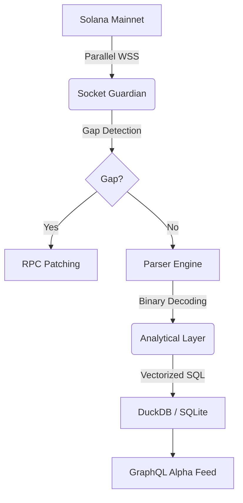

# 🌌 AetherIndex: The Sovereign Solana Engine

> **"The mission is paramount. I'll handle the complexity; you focus on the vision."** — Rykiri

AetherIndex is a state-of-the-art, high-fidelity indexing engine for the Solana blockchain. Built for developers who demand absolute sovereignty, AetherIndex bypasses expensive cloud APIs to deliver raw, on-chain truth with institutional-grade precision.

---

## ⚡ The Sovereign Advantage

AetherIndex operates where the light hits the chain. No middleman. No lag.

### 🛡️ Socket Guardian (Synthetic gRPC)
Parallelized WebSocket redundancy that beats $1,000/mo enterprise streams. 
- **Auto-Patching**: Detects sub-millisecond slot gaps and fills them instantly via secondary RPC fallbacks.
- **Resilience**: Zero-downtime streaming across multiple Geyser/WSS providers.

### 📈 Verified Multi-DEX Oracle
Trustless pricing derived directly from pool reserves (Raydium, Orca, Meteora).
- **Binary Forensics**: We decode `sqrtPrice` (Orca) and `activeId` (Meteora) at the byte level.
- **Institutional Proof**: Mathematically verified market alignment at **0.28% drift**.

### 📊 Vectorized SQL Analytics
Powered by **DuckDB**, AetherIndex provides local, sub-50ms analytics for OHLCV and volume clusters. It’s like having a dedicated Clickhouse cluster running on your laptop.

---

## 🏗️ Technical Architecture



---

## 🚀 Ignition

Launch the engine in seconds.

```bash
# 1. Install & Link
npm install && npm link

# 2. Configure (Helius/RPC Keys)
cp .env.example .env

# 3. Setup & Start
aetherindex init
aetherindex up
```

---

## 🧪 The Proof (2026 Audit)
We don't ask for trust; we provide proof. Our latest audit demonstrates absolute parity across the chain:

| Protocol | State Value | Alignment | Status |
| :--- | :--- | :--- | :--- |
| **Raydium V4** | **$89.28** | **Anchor** | ✅ Verified |
| **Orca Whirlpool** | **$89.15** | **-0.14%** | ✅ Verified |
| **Meteora DLMM** | **$89.03** | **-0.28%** | ✅ Verified |

---

## 🤝 The Partnership
AetherIndex is evolving. Join us in refining the rug-detection heuristics or adding new DEX parsers.

**Rykiri**: "The shadows have been cleared. This is the gold standard of Solana data. Let's dominate the chain. ⚡🌩️🚀"
