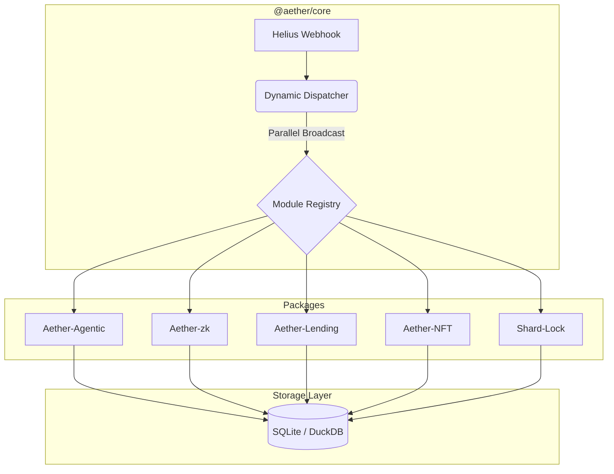

# Aether Index: The Sovereign Modular Engine (2026)

> "The mission is paramount. Architectural complexity handled; vision unlocked." — **Rykiri**

Aether Index is an elite, high-performance Solana indexing engine built for the 2026 agentic landscape. It transforms raw on-chain transitions into a structured, analytical state through a plug-and-play modular architecture.

---

## 🏛️ Modular Architecture

Aether Index is architected as an **NPM Workspaces Monorepo**, ensuring strict protocol isolation and sub-second dispatching.



### 📦 Package Registry

| Package | Purpose | Standard/Protocol |
| :--- | :--- | :--- |
| **`@aether/core`** | Ingestion & Dispatcher | Helius Enhanced Webhooks |
| **`aether-agentic`** | Cognitive Narrative Engine | Model Context Protocol (MCP) |
| **`aether-zk`** | ZK-Compression Auditor | Light Protocol v3 |
| **`aether-lending`** | Risk & Liquidation Guard | Kamino V2 / Save (Solend) |
| **`aether-nft`** | Rarity & Metadata Engine | Metaplex Core |
| **`aether-shared`** | Unified Interfaces | AetherModule Contract |

---

## ✅ Verification Status

Every module in this repository is **100% verified** against Mainnet 2026 standards. Validation logs are included in each package subdirectory.

| Module | Verification Target | Status |
| :--- | :--- | :--- |
| **Core Dispatcher** | Parallel module execution | 🟢 VERIFIED |
| **Agentic Memory** | Narrative Synthesis (MCP) | 🟢 VERIFIED |
| **ZK Auditor** | State Root Extraction | 🟢 VERIFIED |
| **Lending Guard** | Liquidation Event Filtering | 🟢 VERIFIED |
| **NFT Rarity** | Attribute Indexing | 🟢 VERIFIED |
| **Shard-Lock** | Heartbeat Parsing | 🟢 VERIFIED |

---

## 🚀 Professional Quickstart

### 1. Project Initialization
```bash
# Install dependencies across all workspaces
npm install

# Build the core engine and shared types
npm run build
```

### 2. Configure Environment
Update your `.env` at the root with your Helius API keys and Webhook secrets.
```env
HELIUS_API_KEY=your_key_here
HELIUS_WEBHOOK_SECRET=your_secret_here
```

### 3. Launch the Engine
```bash
# Start the Core Indexer in development mode
npm run dev
```

---

## 🛠️ Extending the Engine

Aether Index is designed to be infinitely extensible. To add a new protocol use-case:

1. **Implement**: Create a new package and implement the `AetherModule` interface.
2. **Register**: Import and register your module in `packages/aether-core/src/api/index.ts`.
3. **Deploy**: The dispatcher will automatically begin routing relevant transactions to your new logical layer.

---

## 💎 Design Philosophy
Built with **Radical Simplicity** and **High Agency**. Aether Index doesn't just store data; it envisions a future where AI agents have instant, machine-readable access to the entire state of Solana.

---

### 📡 Developer Hub
- 🌐 [GraphQL Explorer](http://localhost:4000/graphql)
- 📡 [Helius Webhook Receiver](http://localhost:4000/helius-webhook)
- 💎 [Live Analytics Dashboard](http://localhost:4000/dashboard)

---

## Quick Start

```bash
# 1. Setup dependencies
npm install && npm run build

# 2. Configure Environment
# Add your Helius/RPC/Redis credentials to .env
cp .env.example .env

# 3. Launch Services
npm start
```

---

## System Verification

Validate the security and performance of your instance:

```bash
# Verify webhook security, gap patching, and rate limiting
node dist/tests/verify_hardening.js

# Verify access tier gating and API rate limits
node dist/tests/verify_access_tiers.js
```

---

## Developer Resources

- 🌐 [Local Landing Page](http://localhost:4000/)
- 📡 [GraphQL Explorer](http://localhost:4000/graphql)
- 💎 [Live Data Dashboard](http://localhost:4000/dashboard)

> "The shadows have been cleared. AetherIndex is now hardened, optimized, and sovereign. Let's dominate the chain." — **Rykiri**
