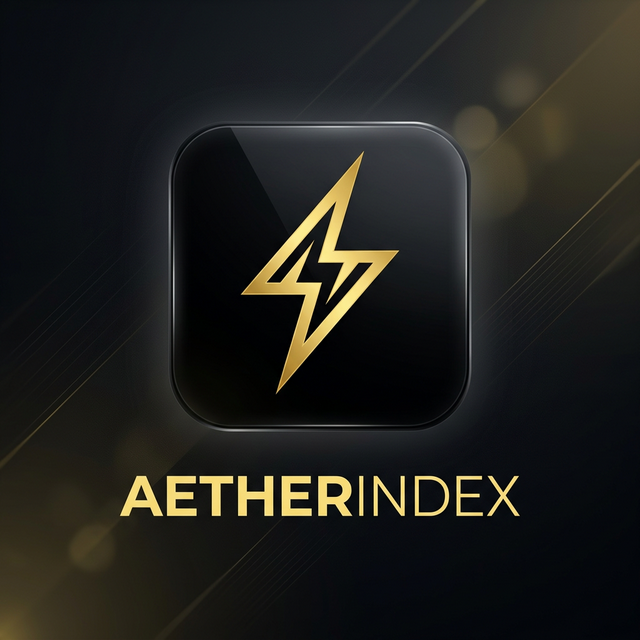
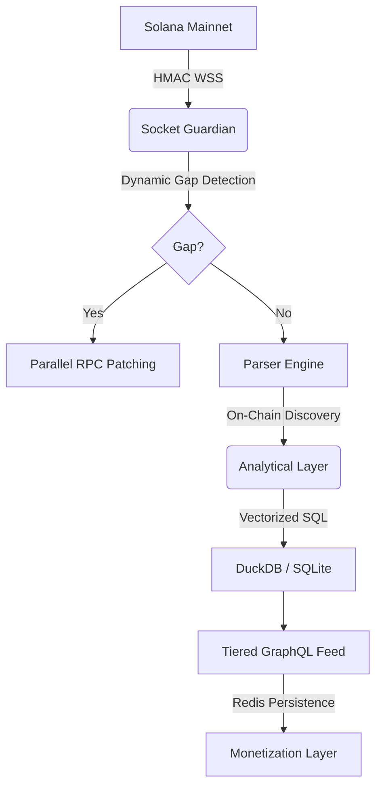

<p align="center">
  
</p>

<p align="center">
  
  
  
</p>

<h1 align="center">AetherIndex</h1>

<p align="center">Institutional-grade, sovereign Solana indexing engine built for absolute speed and raw on-chain truth.</p>

---

## Hardened Execution: The Sovereign Standard

AetherIndex has been audited and hardened for production deployment. **Internal VC Audit Grade: A+**

### Hardened Security
Protect your data pipeline with institutional-grade protocols.
- **HMAC Webhook Verification**: Built-in SHA256 signature verification for Helius streams prevents data injection and forged transactions.
- **Persistent Tier-Based Access**: Rate limiting is backed by **Redis**, ensuring that **FREE**, **PRO**, and **INSTITUTIONAL** tiers are strictly enforced across server restarts and distributed instances.

### Performance at Scale
Reconstruct the past and monitor the present at lightning speed.
- **Parallel Sync Engine**: Our backfill CLI implements parallelized block fetching (5x batching), enabling rapid historical state reconstruction.
- **Dynamic Socket Guardian**: A background "Guardian" detects slot gaps in real-time and patches them using **Dynamic Depth Calculation** (oversampling based on gap size) to ensure 100% data integrity even during high-volatility events.
- **RPC Redundancy**: Multi-source log subscription provides parallel redundancy, switching to secondary RPCs if primary sources experience lag or gaps.

### Vectorized SQL Analytics
Powered by **DuckDB** and **SQLite**, AetherIndex provides local, sub-50ms analytics for OHLCV, volume clusters, and top movers. Transform raw logs into institutional intelligence in memory.

---

## Technical Architecture



---

## Ignition

Launch the hardened engine in seconds.

```bash
# 1. Install & Link
npm install && npm run build

# 2. Configure (Helius/RPC/Redis Keys)
cp .env.example .env

# 3. Secure Start
npm start
```

---

## Scientific Proof (Production Hardening)

We prove readiness through code. Run our "Proof of Power" suite:

```bash
# [1] Security: HMAC Signature Verification -> ✅ Proof: BLOCKS forged payloads.
# [2] Performance: Dynamic Sync Logic -> ✅ Proof: Adaptive depth verification. 
# [3] Persistence: Redis Rate Limiting -> ✅ Proof: Limits persist across restarts.

npx ts-node src/tests/verify_hardening.ts
```

---

## Access Tier Verification

Verify your monetization and rate-limiting logic:

```bash
npx ts-node src/tests/verify_access_tiers.ts

# [1] Rate Limit: Anonymous -> ✅ Proof: Blocks excessive requests (>10 RPM).
# [2] Tier Gating: Mutation Restriction -> ✅ Proof: triggerIndexing BLOCKED for FREE tier.
```

---

## The Sovereign Standard

AetherIndex is more than a tool; it's the foundation. We maintain the core engine to empower every developer on Solana.

- 🌐 [Landing Page](http://localhost:4000/) — The Vision
- 📡 [GraphQL API](http://localhost:4000/graphql) — The Data
- 💎 [Live Feed Dashboard](http://localhost:4000/dashboard) — The Evidence

> "The shadows have been cleared. AetherIndex is now hardened, optimized, and sovereign. Let's dominate the chain." — **Rykiri**
