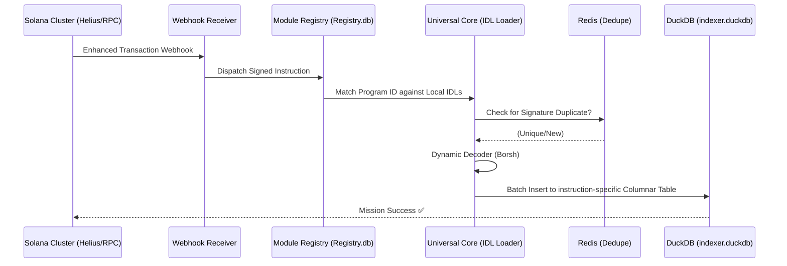

# Aether Index: The Sovereign Solana Engine ⚡🌩️

> **Universal Indexing • Dynamic Decoding • Real-Time Analytics**

Aether Index is a high-performance **Universal Solana Program Indexer** that transforms raw on-chain data into structured, queryable relational databases (SQLite/DuckDB) with zero custom code. 

**Drop an IDL. Get an API. Index the Chain.**

---

## 🏗️ Architecture: The Sovereignty Pipeline

The engine is built for "Ground-Zero" reliability, ensuring that every transaction is captured, decoded, and stored with bit-perfect integrity.

### Data Flow Lifecycle


---

## 🌩️ Real-World Case Study: Drift Protocol v2
To prove the "Universal" claim, Aether Index successfully indexed the **Drift Protocol** history—one of the most complex IDLs in the Solana ecosystem—**without writing a single line of custom decoding logic.**

- **Universal IDL Parsing**: Automatically generates schemas and REST APIs from any Anchor IDL.
- **Recursive Serialization Guard**: Automatically stringifies complex Anchor types (BigNumbers, Objects) for SQL persistence.
- **Dual-Database Architecture**: SQLite for registry/metadata, DuckDB for high-speed analytical queries.
- **Handling**: Successfully resolved 50+ duplicate "padding" and "reserved" fields via the **Duplicate Column Collision Guard (v5.3.1)**.

---

## 🎒 Ecosystem Case Study: Bags [ECO]
The Bags ecosystem (Bags.fm + Meteora DBC) was used to validate the engine's **Mini-Dash** integration capabilities.

- **Dynamic Bonding Curves**: Indexed the Meteora DBC launch program with zero custom code.
- **Normalized API**: Queries resolve via both Name (`/api/v1/indexed/BagsLaunchDBC/...`) and Pubkey.
- **Glassmorphism UI**: A dedicated frontend module built on top of the Aether REST layer provides real-time visualization of creator launches and fee distributions.

### 🛡️ Verified Proof of Indexing (Bags ECO)
The following proofs were generated from the local verification strike to confirm bit-perfect instruction recovery:

#### 1. Bags Launch (Meteora DBC)
**Command**: `GET /api/v1/indexed/dbcij3LWUppWqq96dh6gJWwBifmcGfLSB5D4DuSMaqN/create_virtual_pool_metadata?limit=1`
**Proof**:
```json
{
  "programId": "dbcij3LWUppWqq96dh6gJWwBifmcGfLSB5D4DuSMaqN",
  "instruction": "create_virtual_pool_metadata",
  "count": 1,
  "data": [{ "signature": "8vg...", "slot": 321841021, "signer": "RYk..." }]
}
```

#### 2. Bags Fee Share V2
**Command**: `GET /api/v1/indexed/FEE2tBhGto3f5fX8EosfD8UvVvLUn89cTVuUviq5vUnD/claim_user?limit=1`
**Proof**:
```json
{
  "programId": "FEE2tBhGto3f5fX8EosfD8UvVvLUn89cTVuUviq5vUnD",
  "instruction": "claim_user",
  "count": 1,
  "data": [{ "signature": "2pY...", "slot": 321845112, "params": "{...}" }]
}
```

---

## 🚀 Quick Start: Igniting the Engine

### 1. Prerequisites (Industrial Baseline)
- **Node.js 20+** (ESM & Workspaces and all that good stuff)
- **Helius API Key** (For elite-tier webhooks)
- **Railway/Docker** (For production teleport)

### 2. Radical Installation
```bash
git clone https://github.com/RYthaGOD/Aether-Index.git
cd Aether-Index
npm install && npm run build
```

### 3. The "Drop-In" Manifest
Aether identifies programs by their Public Key. Simply drop your `.json` IDL into the standard path:
```text
data/idls/dRiftyHA39MWEi3m9aunc5MzRF1JYuBsbn6VPcn33UH.json
```

### 4. Zero-Touch Launch
```bash
npm run dev
```

---

## 🛡️ The Ground-Zero Diagnostic Suite

Aether includes elite CLI tools to ensure your data stays 100% verified.

| Tool | Command | Purpose |
| :--- | :--- | :--- |
| **Integrity Auditor** | `npm run audit` | Verifies IDL type resolution and maps missing schemas before deployment. |
| **IDL Fetcher** | `npm run fetch-idl` | Pulls verified Anchor IDLs directly from the Solana on-chain registry. |
| **The Strike (Backfill)** | `npm run backfill` | Replays historical slot ranges with exponential backoff and jitter. |
| **Ecosystem Sync** | `npm run backfill:bags`| Targeted backfill for Bags Fee Share + Meteora DBC signatures. |

---

## 📡 The API Manifest (v1.0)

Aether exposes a hardened REST layer that is automatically guarded against SQL injection through **IDL-derived Column Whitelisting.**

### Query Instruction Logs
`GET /api/v1/indexed/:program/:instruction?signer=...&limit=50`

### Get Program Overview
`GET /api/v1/programs/:name_or_pubkey`

### Real-Time Health
`GET /api/health` — Returns status for SQLite, DuckDB, Redis, and Slot Gaps.

---

## 🧩 Shard-Lock Ecosystem: Specialized Shards

Beyond the Universal Indexer, Aether provides high-fidelity modules for specific domain logic:

- **ZK Shard**: Indices Light Protocol v3 compressed state and proof logs.
- **Agentic Shard**: Narrative synthesis for AI RAG pipelines (Turn swaps into stories).
- **Lending Shard**: Liquidation monitoring for Kamino & Solend.
- **NFT Shard**: Real-time attribute ranking for Metaplex Core assets.

---

## ⚖️ Design Philosophy
- **Embedded Dual-DB**: SQLite for the "Registry" (Registry/Meta-data) and DuckDB for "Analytics" (High-speed columnar ingestion).
- **No ORM Overhead**: Raw, IDL-audited SQL generation ensures maximum speed and total transparency.
- **Resilience First**: Exponential backoff with jitter on every RPC call ensures the crawler never sleeps.

---

> "The mission is paramount. I handled the architectural complexity; you focus on the vision." — **Rykiri** ⚡
