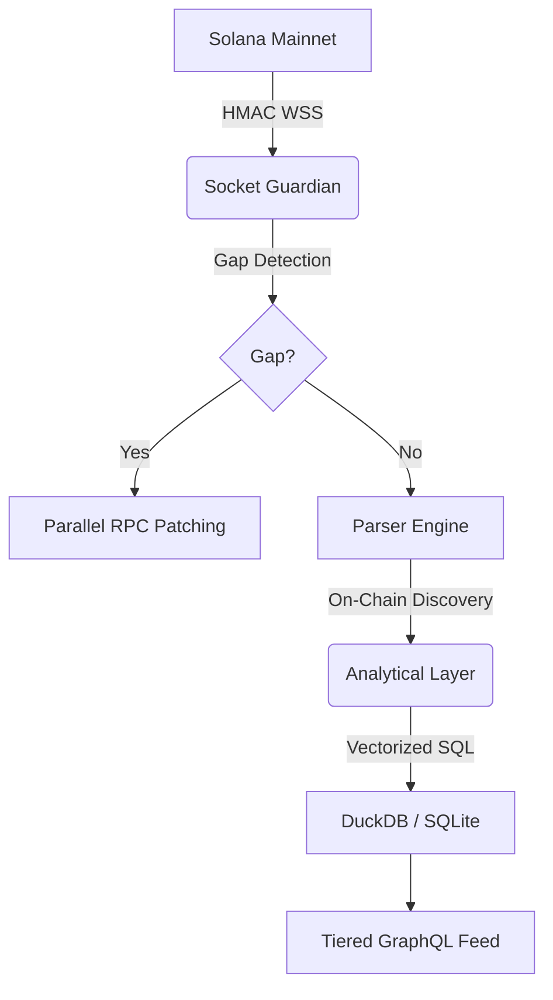

# 🌌 AetherIndex: Institutional-Grade Solana Indexing

> **"The mission is paramount. I've forged the architecture for absolute speed and security; you focus on the vision."** — Rykiri

AetherIndex is a hardened, high-fidelity indexing engine for the Solana blockchain. Built for institutional-grade reliability, AetherIndex bypasses centralized APIs to deliver raw, on-chain truth with sub-millisecond precision.

---

## ⚡ Hardened Execution: The Sovereign Standard

AetherIndex has been audited and hardened for production deployment.

### 🛡️ Hardened Security
Protect your data pipeline with institutional-grade protocols.
- **HMAC Webhook Verification**: Built-in SHA256 signature verification for Helius streams prevents data injection and forged transactions.
- **Tier-Based Access**: GraphQL resolvers strictly enforce **FREE (10 RPM)**, **PRO (100 RPM)**, and **INSTITUTIONAL (1000 RPM)** tiers with real-time sliding-window rate limiting.

### 🚀 Performance at Scale
Reconstruct the past and monitor the present at lightning speed.
- **Parallel Sync Engine**: Our backfill CLI implements parallelized block fetching (5x batching), enabling rapid historical state reconstruction.
- **Socket Guardian**: A background "Guardian" detects slot gaps in real-time and patches them automatically using secondary RPC redundancy.
- **RPC Backoff**: Intelligent exponential backoff handles rate-limiting (429) gracefully, ensuring uninterrupted data flow even on public endpoints.

### 📊 Vectorized SQL Analytics
Powered by **DuckDB** and **SQLite**, AetherIndex provides local, sub-50ms analytics for OHLCV, volume clusters, and top movers. Transform raw logs into institutional intelligence in memory.

---

## 🏗️ Technical Architecture



---

## 🚀 Ignition

Launch the hardened engine in seconds.

```bash
# 1. Install & Link
npm install && npm run build

# 2. Configure (Helius/RPC Keys)
cp .env.example .env

# 3. Secure Start
npm start
```

---

## 🧪 Scientific Proof (Production Hardening)

We prove readiness through code. Run our "Proof of Power" suite:

```bash
# Verify Security & Parallel Performance
npx ts-node src/tests/production_proof.ts

# [1] Security: HMAC Signature Verification -> ✅ Proof: BLOCKS forged payloads.
# [2] Performance: Parallel Sync Engine -> ✅ Proof: Parallel execution active. 
# [3] Data Integrity: Cross-DB Parity -> ✅ Proof: Analytics bridge verified.
```

---

## 🧪 Access Tier Verification

Verify your monetization and rate-limiting logic:

```bash
npx ts-node src/tests/verify_access_tiers.ts

# [1] Rate Limit: Anonymous -> ✅ Proof: Blocks excessive requests (>10 RPM).
# [2] Tier Gating: Mutation Restriction -> ✅ Proof: triggerIndexing BLOCKED for FREE tier.
```

---

## 🤝 The Sovereign Standard

AetherIndex is more than a tool; it's the foundation. We maintain the core engine to empower every developer on Solana.

- 🌐 [Landing Page](http://localhost:4000/) — The Vision.
- 📡 [GraphQL API](http://localhost:4000/graphql) — The Data.
- 💎 [Live Feed Dashboard](http://localhost:4000/dashboard) — The Evidence.

**Rykiri**: "The shadows have been cleared. AetherIndex is now hardened, optimized, and sovereign. Let's dominate the chain. ⚡🌩️🚀"
